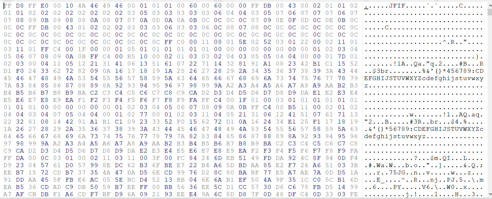
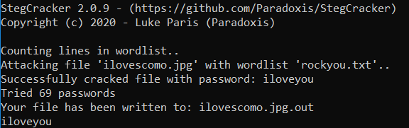
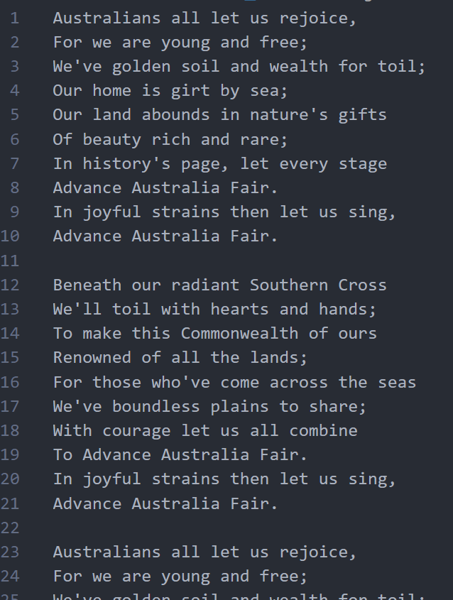
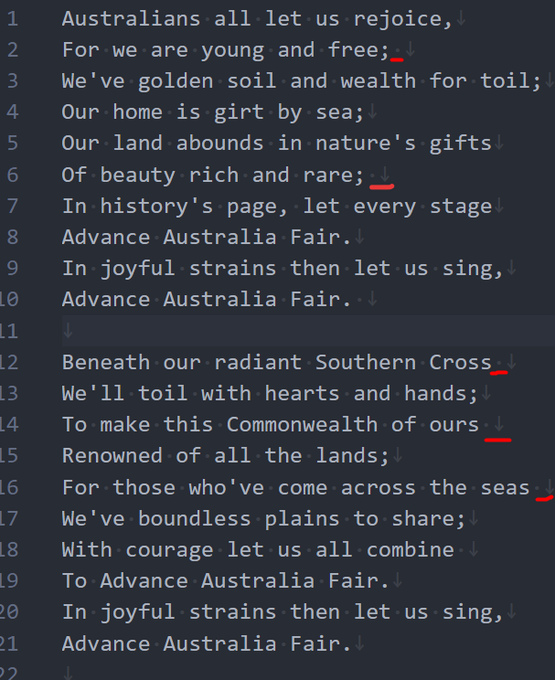
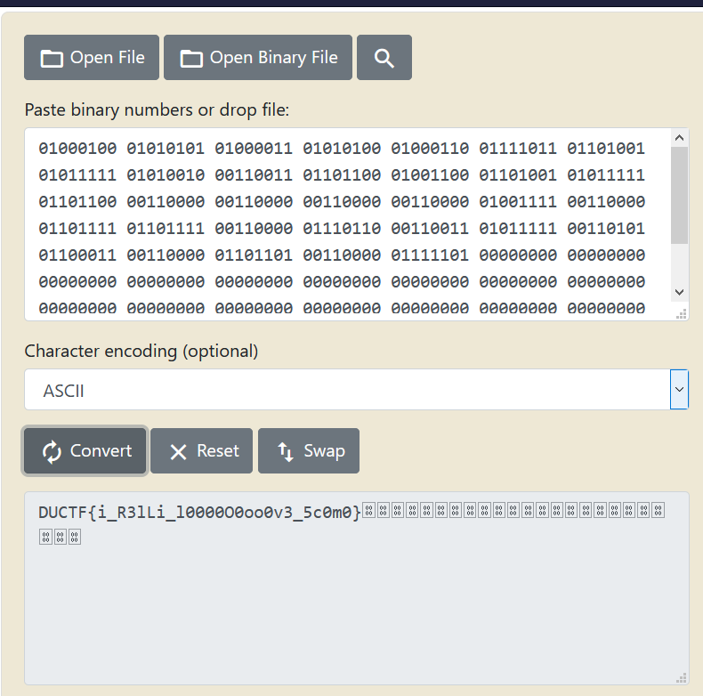

# I love ScoMo
It's another JPG file for steganography! 

## Initial Thoughts
Firstly, let's test the very basic hiding mechanisms. We'll look at the file first using a hex editor, to see if there is any hidden text inside.



But things are rarely so easy, so a quick google search about hiding items inside a JPG yields `steghide`, a mechanism for hiding text inside `.jpg` files.

After testing various attacks, it's probably better to use a brute force algorithm to check for various passwords.

## Algorithm Attacks
Thus, we bring in `Stegcracker`, a tool designed to brute force attack by trying a large set of passwords. Let us use the recommended files, Kali Linux's `rockyou.txt`.



Let's check out what we got from the algorithm!

## More Complexity

It appears to be the Australian Anthem, repeated many times. However, when we copy one paragrah and search for it, it doesn't match the next paragraph despite having the same text.

The answer? **Hidden spaces**. But what could this yield?


## Out of Space
Initial searching yielded SNOW algorithms for hiding messages in whitespace. However, this is a red herring, as when we perform our own testing using SNOW, we get many spaces where this only yields one.

So what could it be?

## The answer, finally
See above, where we highlighted some whitespace on the end of certain lines. Perhaps, this could be binary code?

Let's test. We know a flag starts with D, and this is `01000100` in binary. This means that we need a 1 in the 2nd and 6th line, which just happen to match our 2nd and 6th line exactly!

## Algorithm to simplify this
Let's write something in python to quickly get us the binary we need.

```python
f = open("secret_message.txt", "r")
line_no = 0
bintest = ""
storage = f.readlines()
for x in storage:
    current_line = x
    if current_line.endswith(" \n"):
        bintest+="1"
    else:
        bintest += "0"
    line_no += 1
    if line_no % 8 == 0:
        bintest += " "

print(bintest)
```
## Final Steps
With our output, let's plug it in to an online converter, and ...


We obtain our flag: `DUCTF{i_R3lLi_l0000O0oo0v3_5c0m0}`
