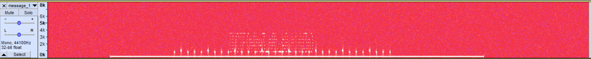
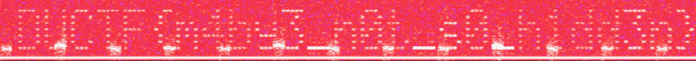

# On The Spectrum #
This is a relatively simple beginner challenge.

## Audio Files
The most common way to encrypt audio files is through hiding the message in the spectrogram.
Given this, and the fact that the message is inaudible when listened to, leads one to think that this could be a possible avenue.

## Audacity
With this, we run `Audacity` and stretch out the spectrogram to see if something is visible.

This yields some visible dots on the background, that if we zoom in yields some text:

## Finale
After squinting a bunch, we can vaguely distinguish a message, which turns out to be the flag: `DUCTF{m4by3_n0t_s0_h1dd3n}`!