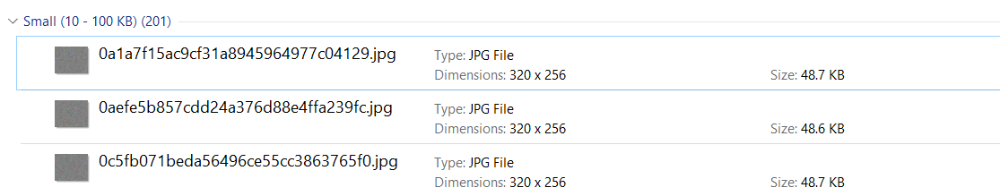
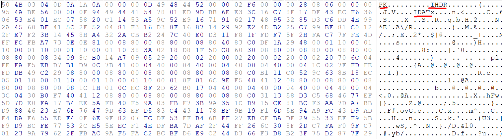
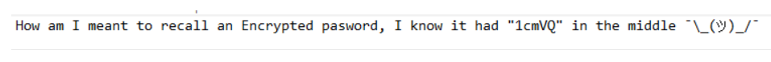
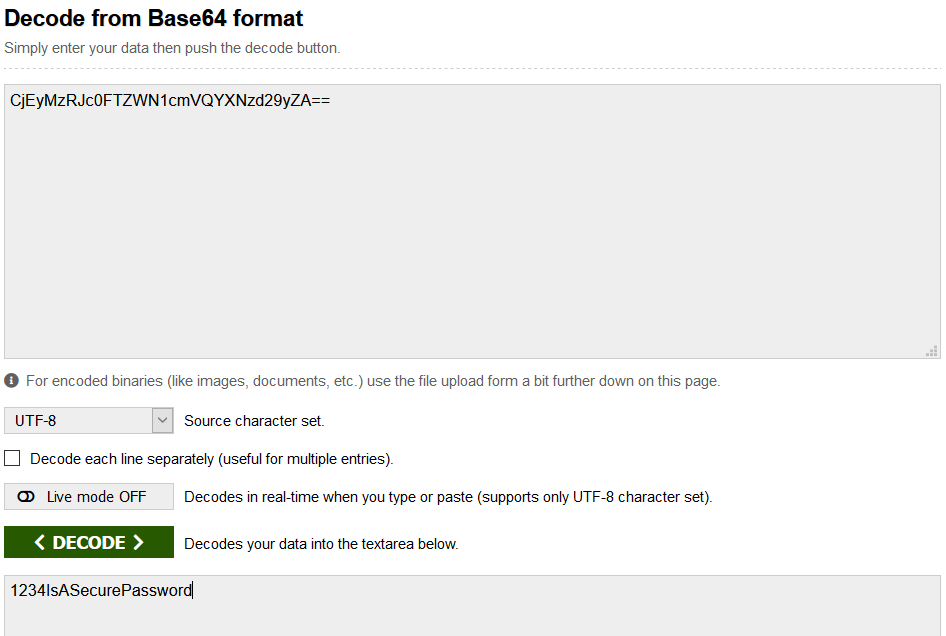

# Spot the Difference #
## Initial Steps
We know that the algorithm involves using `Steghide` from the description, but `steghide` only operates on certain file types, mainly jpeg.

Thus, we go looking for images, and find several inside the `\images\` folder.


Firstly, I tried decryption using a brute force algorithm known as `Stegcracker`, using the Kali Linux `rockyou.txt` database. This doesn't yield anything for a while, so let's take a look whilst the algorithm plugs away in the background.

## Getting closer

We notice a folder known as `badfiles`, in which there are 200 files loaded. These files don't differ much in terms of file size, and none of them stand out.

This is obviously not going to be done via brute force, as the computation time is too long. Thus, we search onwards to look for more clues.

## Config?
Finally, we get to `.config`, where we notice a folder named `secret`, with 40 folders and 40 txt files in each. In addition to that, we notice a `Reminder.png`. 

### Clues
`Reminder.png` is not openable, strangely enough. 
We can run `file Reminder.png`, but it yields a ZIP folder for some reason.

Upon closer inspection, we check the header of the file-> it had a PK, indicating a ZIP.
However, renaming to `.zip` and trying to extract yields garbage.

### What gives?
We need to go back and take a better look at the file, and this can be done through `hexdump`. In this, we notice there are parts inside that are indicative of a `.png` file, with `IDHR` and `IDAT` chunks respectively.



Thus, maybe the file header is malformed. Testing this theory, we run a hex editor and change the start of the hex to the PNG format of `137 80 78 71 13 10 26 10`.

## Bingo
 
From this, we finally get a usable image, and with it, another hint!
Note two bits of information here- the password details, and the emphasis on **encryption**.

Firstly, the password:
We saw 40*40 possible passwords, so we write a quick python script `PasswordDmp.py` to accumulate them all into one file.

```python
import os

rootdir = "./"
pwlist = []
for dirName, subdirList, fileList in os.walk(rootdir):
    for fname in fileList:
        if fname.endswith(".txt"):
            f = open(dirName + "/" + fname, "r")
            data = f.read()
w = open("passwords.txt", "w+")
for i in pwlist:
    w.write(i)
```

We then search through the file to find one matching result-> the encrypted password itself.

## Brute Force
From here on, items are simple. We run a quick shell command:
```sh
for f in *; do steghide extract -sf $f -p <password>; done
```
With this, the shell rapidly executes the command on every image in the file, hopefully finding us our password.

But wait, no results?

### Encryption
Remember the encryption emphasis earlier? Well now, we need to figure out the format of the password.
`CjEyMzRJc0FTZWN1cmVQYXNzd29yZA==`
We can see that it is 32 characters long, with 2 `=` signs on the end.

A quick google search yields Base64 encryption. 
We plug this into the calculator, and... we have a usable password.


## Finale
With this, we simply plug the correct password into the shell script earlier, and thus, we obtain our flag from `SecretMessage.txt`, `DUCTF{m0r3_th4n_M33ts_th3_ey3}`.